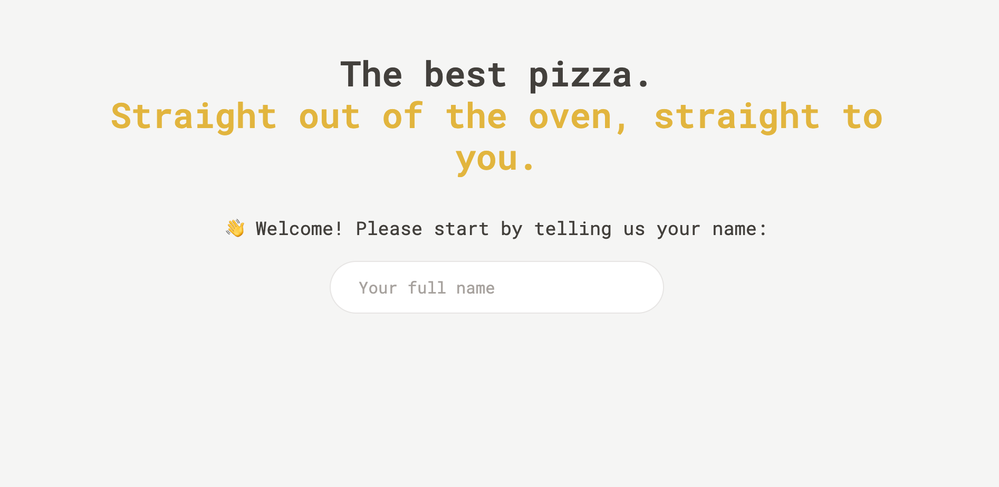
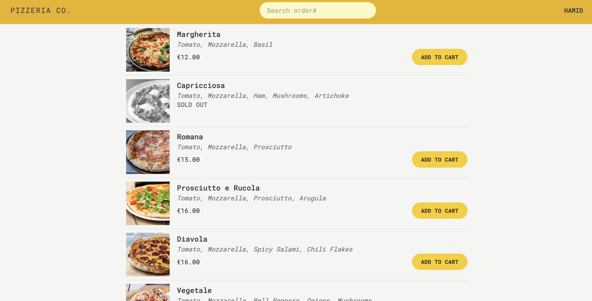
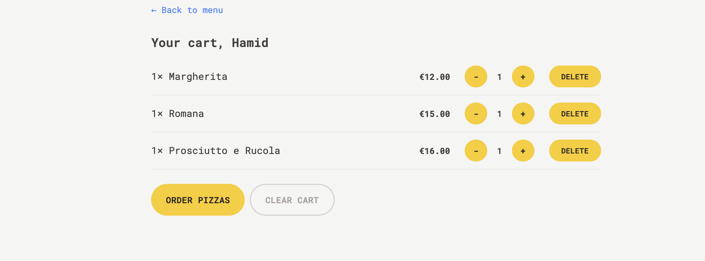
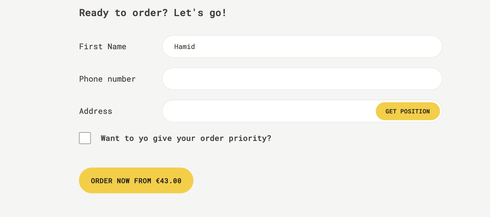
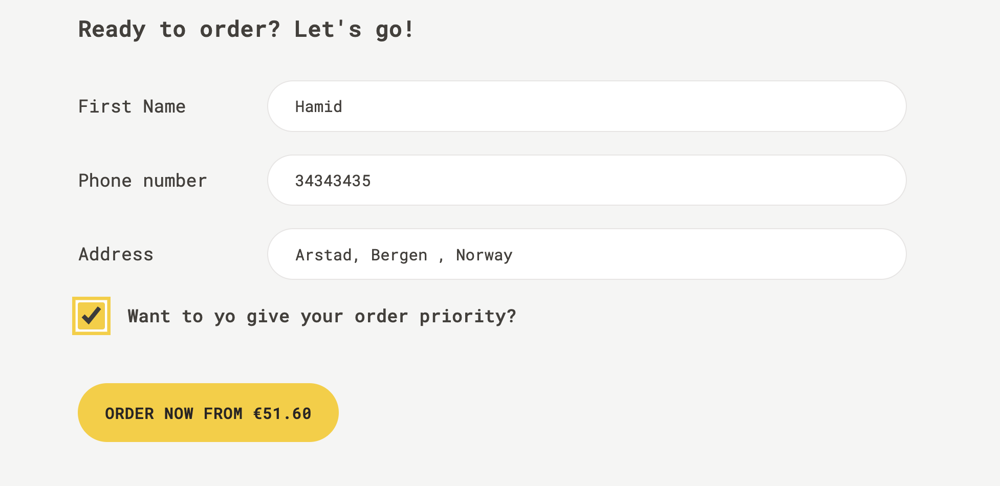
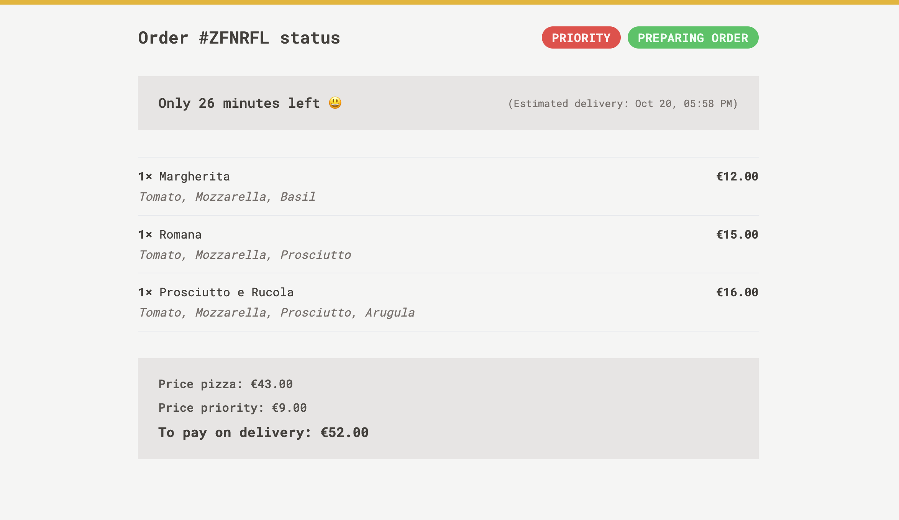

# An online pizza ordering platform built with React + Vite & Tailwind CSS

## Demo

## Getting started 🚀
- git clone
- npm install
- npm run dev

## Functionalities
- can order pizza
- track arrival time
- get notification upon arrival 

## Tech stack
- React + Vite
- React Redux
- React Router 
- Tailwind CSS